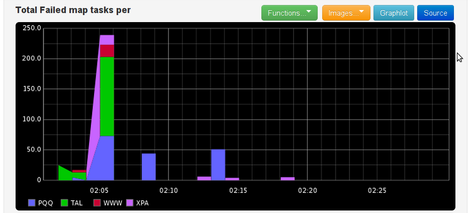
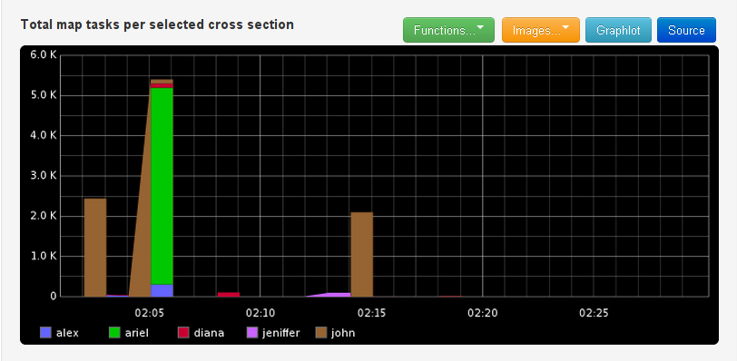
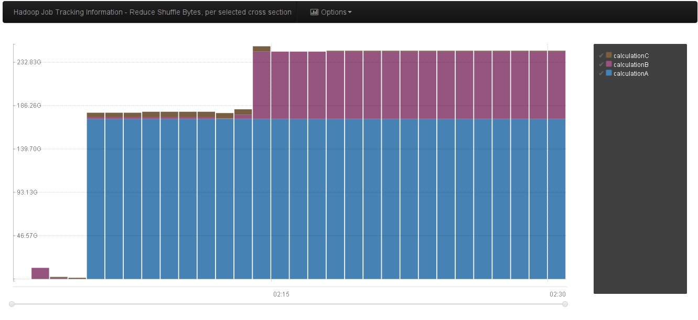

# Hadoop Job Analyzer
Hadoop job analyzer is a tool that analyzes hadoop jobs, aggregates the information according to user specified crosssections, and sends the output to a metrics backend for visualization and analysis.

The tool is non intrusive and is based on analyzing the history folder in the jobtracker.

## Job Analysis
The tool analyzes and exposes all the information about the job. This ranges from mapper/reducer counts (including failed counts), processing durations, input/output record counts and bytes, up to dynamic counters created by higher layers (such as Hive-Level counters), and even by the tool itself, such as the duration of time between job submission and actually beginning job execution.

All the data for each job is broken down into "fields", each contain a piece of information regarding the jobs. For example, `SUBMIT_TIME` contains the job submission time, `USER` contains the name of the user running the job and `SOURCE_HOST` contains the name of the host submitting the job. 

The tool also supports extraction of job metadata from the jobname using regular expressions. The extracted metadata becomes part of the job information and the user can choose to aggregate based on it similar to any other fields. See below for examples.

## Aggregation
The tool provides intrinsic aggregation capabilities. The aggregation is done on two levels simultanously:

* _Time based aggregation_ - Every job is put into a "time bucket", which is calculated from one of the time related fields of the job. By default, the time bucket is calculated to 1 minute intervals according to the job submission time. 

* _Field based aggregation_ - The user can ask for multiple views or "projections" of the data, based on the value of fields. The most common projections are `SOURCE_HOST` and `USER`, which will provide views based on the submitting host and the requesting user, respectively. The tool supports an arbitrary number of projections of the same data.

## Metric Sending
Ultimately, the tool is meant for exposing the job information in a usable way to a metric backend, for analysis, trending and troubleshooting purposes.

Currently, the tool supports sending the metrics to **graphite** and **stdout**. Additional metric backends can be supported through a simple plugin mechanism.

A [Graphitus](https://github.com/erezmazor/graphitus) dashboard for the metrics sent to graphite is also included, for easy visualization of the data the tool sends. If you don't know graphitus, you should. 

To use the graphitus dashboard, just copy the dashboard to your dashboard repository and replace the metric name prefix to your prefix in the dashboard json file.

### Example Graphs using Graphite and Graphitus

## Usage
Just get the source files to your job tracker, and run ./hadoop-job-analyzer with the proper parameters using cron or any periodic scheduler.

Whenever the tool is run, it analyzes everything in the history folder and submits the entire analysis to the metric server. This allows the users to run the tool whenever they like the data updated.

### Parameters
The following parameters can be provided:

#### Analysis related parameters
* `-f` - The location of the jobtracker's `history/done` folder. Should be local or some mount to the jobtracker
* `-l` - List all available fields, possibly with sample values from actual jobs. Use -s to control the number of samples
* `-j` - A regexp allowing to dissect the job name for each job and extract fields from it. The regexp should be a pythonic named groups regexp. Each named group will automatically be available to other parts, as if it was part of the job's information. It will also participate in the output of the -l parameter. The parameter is not mandatory of course.
* `-m` - Maximum length of job name metadata extracted using `-j`. Values longer than this value will be replaced with "toolong". This is a defense mechanism against clutter caused by non compliant job names.
* `-r` - Relaxed mode. In this mode, non compliant jobs and missing fields will not cause the analysis to stop

The `-l` flag is very useful for getting visibility regarding the available fields and their value. Use it in conjunction with `-s` which controls the number of samples to fetch for each of the available fields.

#### Aggregation related parameters
* `-p` - The required aggregations. The aggregations should be separated by a comma. Composite aggregations can be provided, separating the fields by a slash. For example, to aggregate by USER and by the combination of the source host and the job queue use "USER,SOURCE_HOST/JOB_QUEUE". Use -l to get a list of the available fields
* `-t` - The name of the field which will be used to associate a job with a certain time and to aggregate data over time. Defaults to SUBMIT_TIME, and should rarely be changed
* `-i` - The required time interval for aggregation in seconds. This is actually the size of one time bucket. Defaults to 60 - one minute. Please note that when using graphite, you can use the summarize() function in order to perform time aggregations on a per-query basis, so there is no need to change this interval at all.

#### Metric sending related parameters
* `-C` - The type of the metric client. Currently supported types are stdout and graphite. Note that graphite requires the following client parameters: server=X,port=Y.
* `-P` - Parameters to be passed to the metric client. A comma separated list of name=value pairs. For example: server=graphite.domain.com,port=2003
* `-n` - Prefix for all metrics. You can add ${HOSTNAME} in the prefix and it will be replaced with <domain>.<hostname>. For example, "data.hadoop.jobtracker.${HOSTNAME}. Please note that you'd need to use single quotes in the command line so the $ sign will not be parsed by the shell

## Examples

### Getting the list of available fields
The following example shows how to get a list of all fields which are available. The list is dynamic and is based on the actual jobs in the provided folder. In addition to providing the list of the fields, it also provides samples of the data for each field (taken from the job themselves).

		./hadoop-job-analyzer -f example-history-folder/ -l -s 2

This example analyzes the jobs in the example-history-folder folder and lists the fields which are available according to these jobs. In addition, it outputs 2 sample values for each of the fields. If `-s` is not provided, the number of samples will be 3 by default. 

Let's see partial output from this command:

		SOURCE_HOST
			--> hostB_mydomain_com
			--> hostC_mydomain_com
		FINISHED_REDUCES
			--> 52.0
			--> 4.0
		COUNTERS.FileSystemCounters.HDFS_BYTES_READ
			--> 535.0
			--> 51801816991.0
		USER
			--> diana
			--> jeniffer
		LAUNCH_LATENCY
			--> 0.176000118256
			--> 9.75900006294

Looking at this output, you can see that there is an automatic flattening of job counters (in this case the HDFS Bytes read counter). Also, there are also derived fields, in this case the LAUNCH_LATENCY, which is calculated and not part of the job's original data. 

Note that when using `-l`, no metrics are actually being sent anywhere.

### Aggregation
This example shows how to actually perform aggregations. For this example, we'll use the **stdout** metric backend type, so all the metrics would be printed to stdout.

		./hadoop-job-analyzer -f example-history-folder/ -p USER,SOURCE_HOST -n 'data.jobtracker.${HOSTNAME}' -C stdout

There are multiple things to note here in the command line:
* The history folder is the example folder we previously used. 

* The `-p` parameter is "USER,SOURCE_HOST". This means that we requested to get two views - One per user and the other per source host (submitting host name).

* The `-n` parameter defines the prefix which we want for all the metrics that are sent. Note that there's a special value ${HOSTNAME} as part of the prefix. When it is used, the tool replaces it with a <domain>.<host> structure of the current hostname (which will usually be the job tracker machine). This allows to easy handle metrics multiple job trackers on the metric backend side.

* The `-C` parameter just says that we would like to use the **stdout** metric client. The plugin for stdout just spits out all the metrics to the screen, as we'll see in a moment.

Here is some of the output written to the screen after running the command:

		...
		Metric for projection <spec=('USER',)> - name is data.jobtracker.unknown-domain.harel-laptop.USER.alex.ACTUAL_DURATION.value value is 2364.748 timestamp is 1368597540
		Metric for projection <spec=('USER',)> - name is data.jobtracker.unknown-domain.harel-laptop.USER.john.ACTUAL_DURATION.value value is 1177.502 timestamp is 1368598440
		Metric for projection <spec=('USER',)> - name is data.jobtracker.unknown-domain.harel-laptop.USER.jeniffer.ACTUAL_DURATION.value value is 1297.222 timestamp is 1368598380
		...
		Metric for projection <spec=('SOURCE_HOST',)> - name is data.jobtracker.unknown-domain.harel-laptop.SOURCE_HOST.hostA_mydomain_com.ACTUAL_DURATION.value value is 1419.047 timestamp is 1368597900
		Metric for projection <spec=('SOURCE_HOST',)> - name is data.jobtracker.unknown-domain.harel-laptop.SOURCE_HOST.hostC_mydomain_com.ACTUAL_DURATION.value value is 7071.148 timestamp is 1368597900
		Metric for projection <spec=('SOURCE_HOST',)> - name is data.jobtracker.unknown-domain.harel-laptop.SOURCE_HOST.hostB_mydomain_com.ACTUAL_DURATION.value value is 789.681 timestamp is 1368597840
		...

This is actual output from the stdout metric plugin. You can see that the `ACTUAL_DURATION` field is aggregated both on a per `USER` basis (`USER.alex`, `USER.john` etc.) and on a per `SOURCE_HOST` basis (`SOURCE_HOST.hostA`, `SOURCE_HOST.hostC` etc.). The aggregations are separate, providing two separate views of the same data. 

Another thing to look here is that the timestamps are rounded to 1 minute intervals (the default). The tool provides the time aggregation as well, in parallel to the projections (Meaning you get a multiple of "time X projection_values" for each field).

It is important to note that by default, the association of a job with a specific time is done using the `SUBMIT_TIME` field (rounding it to the 1 minute intervals). Both the time field itself and the interval can be modified using the `-t` and `-i` parameters.

And another small thing - Note the "unknown-domain.harel-laptop". This is the value that the tool has replaced instead of the `${HOSTNAME}`. In a real job tracker machine, it would provide the domain and the hostname of the job tracker.

### Sending the metrics to graphite
In this example, we'll just the metrics to graphite. The command line is similar to the one in the aggregation example (which used the **stdout** metric plugin), but now we'll use the graphite plugin.

In contrast to the stdout plugin, the graphite plugin requires parameters in order to work. Specifically, it requires the server and port of the graphite backend. We can pass parameters to the metric plugin by using the `-P` parameter:

		./hadoop-job-analyzer -f example-history-folder/ -p USER,SOURCE_HOST -n 'data.jobtracker.${HOSTNAME}' -C graphite -P server=graphite.domain.com,port=2003

Adding the `-P` parameter allows the plugin to use these parameter when initializing. Note that when running this command, no output will be written to the console (The metrics are sent to graphite).

### Extracting job metadata from the job name
The tool provides a method for treating parts of the job name as metadata, adding more fields to each jobs. These "fields" can then be used for aggregation, projection etc.

In order to treat the job name as metadata, use the `-j` parameter. This parameter accepts a [python regular expression](http://docs.python.org/2/library/re.html) that contains named groups. These named groups will automatically become fields in the job in case of a match (You'll be able to see them in the output of a `-l` command).

For the sake of the example, let's assume that the job name is in the format "<team>:<algorithm>:<subalgorithm>", and we want the team and algorithm to participate in aggregations.

		./hadoop-job-analyzer -f example-history-folder/ -n 'data.jobtracker.${HOSTNAME}' -C stdout -p TEAM,ALGORITHM,USER -j '^(?P<TEAM>.*?):(?P<ALGORITHM>.*?):'

A few notes about the command line:

* We're using single quotes around the `-j` parameter value, so the shell won't interpret the regexp in any way.  
* The regexp contains named groups for naming the parts matches by the regexp. Python uses `(?P<name>...)` for named groups.
* The regexp uses non-greedy wildcards on purpose - E.g. using `.*?` instead of `.*`. The greedy version would not provide us with what we need here.
* The `-p` parameter (projections required) uses TEAM and ALGORITHM as if they were standard fields of the job

Running the same command with the `-l` parameter would give us the following (partial) output.

		...
		TEAM
			--> PQQ
			--> XPA
			--> WWW
		...
		ALGORITHM
			--> calculationB
			--> calculationB
			--> calculationC

In order to prevent cluttering of the metric namespace in cases where the job name is not compliant with the required format, the tool enforces a limit on the maximum length of a value extracted from the job name. If the extracted value is longer than the maximum, the value will be replaced by `toolong`. The limit can be easily changed using the `-m` parameter.

## Relaxed Mode
By default, any analysis problem will cause the tool to stop its analysis and fail. Activating relaxed mode by adding the `-r` parameter will allow to continue processing the next jobs even in the face of errors. I would appreciate it if you sent me the job files in cases like that, if you think it's a bug in the tool itself.

## Metric backend plugins
The tool uses a simple plugin mechanism for the metric backend access. A metric backend plugin is just a python module called `hja-<metric-backend-id>.py`, which should implement the following functions:

* `initialize(params)` - The plugin should initialize. `params` contain a map with the parameters passed by the user using the `-P` command line parameter
* `projection_started(proj)` - Sending the metric for a specific projection has started. proj is the projection object itself, and contains metadata about the projection
* `projection_finished(proj)` - Sending the metric for a specific projection has finished
* `add_metric(proj,name,value,timestamp)` - The plugin should add the metric to the list of metrics to send (or it can just send the metric directly...). The projection object is provided here as well, along with the name, value and timestamp of the metric. The name is a string and both the value and the timestamp are floats.
* `done()` - The plugin should do its cleanup, if needed.

The stdout plugin (which resides in hja-stdout.py) can be used as an easy baseline for writing a new plugin.

`NOTE:` The interface to the metric plugins is currently an easy (metric_name,metric_value,timestamp) interface, in which the metric name is an already processed string. In the future, depending on need, a more structured interface will be created, which will allow the plugins more freedom.

## Conventions

* All `_TIME` fields are Unix timestamps, and are eventually removed from the metric sending part (e.g. there is no need to aggregate a bunch of absolute unix timestamps...).

* All `_DURATION` and `_LATENCY` fields are in Seconds

* Counters are flattened automatically to `COUNTERS.<counter-group>.<counter-name>`

* `JOB_STATUS` is treated in a special way since it's an enum. It is falttened out to `JOB_STATUS.<status>` with a value of 1. This allows easy aggregation of job counts per status.

## Logging
The tool writes a rotated log file to the logs/ folder under the location of the tool itself.

Note that this doesn't affect the stdout metric plugin, which writes directly to stdout regardless of the logging.

## Limitations
* The tool was tested on Hadoop CDH3u3. CDH4 support, at least for MR v1, will be added soon

* Currently, only graphite is supported as a metric backend. Others will be added in the future. You are welcome to write a plugin of your own and send a pull request.

* Metric names are currently fully processed by the infrastructure and not by the metric plugin. This might change in the future.

* The tool currently sends the entire results to the metric backend, regardless if they have been sent to the metric backend in a previous run. For graphite, this works perfectly since the data is overrun by graphite and it allows the tool to remain simple in that regard. In the future, this might change to become more efficient (and possibly compliant with other metric backends).

* Currently, all aggregation are sum() aggregation. If needed, aggregation types will be added, possibly by providing a `.AVG`, `.SUM` versions of the metrics.

## Examples General Note
Please note that the basis for the examples in the example folders is based on real job files, but was modified in order not to expose any business related data.

## Contact
Any feedback would be much appreciated, as well as pull requests, of course.

Harel Ben-Attia, harelba@gmail.com, @harelba on Twitter

