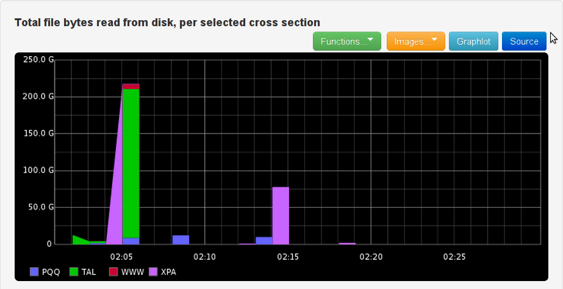
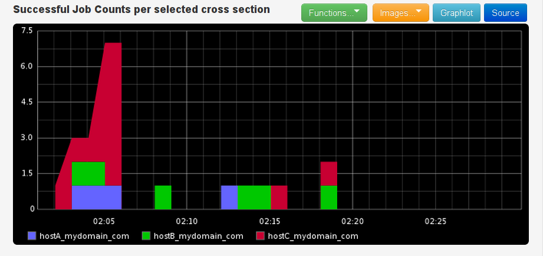
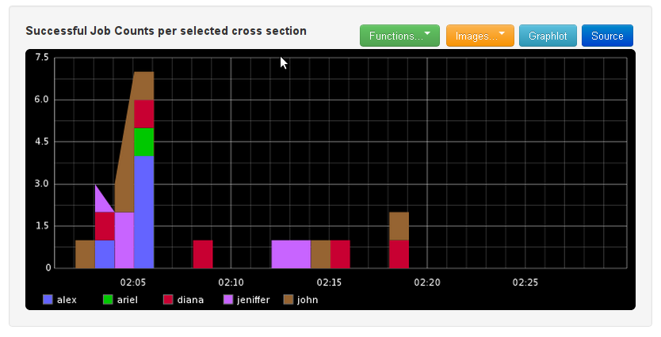
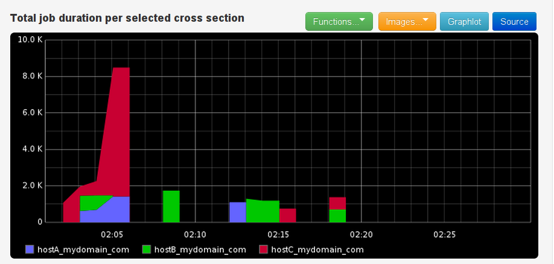
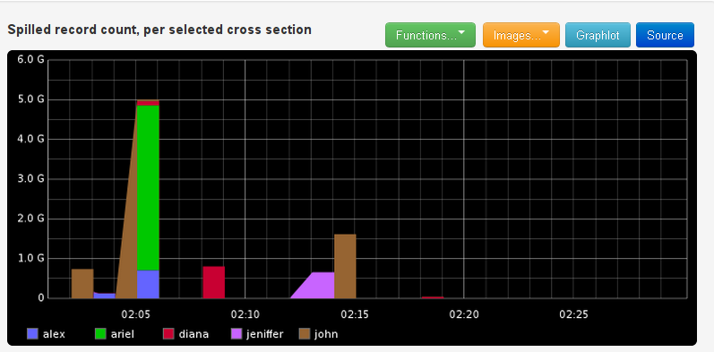

### Example Graphs using Graphite and Graphitus

# Hadoop Job Analyzer
Hadoop job analyzer is a tool that analyzes hadoop jobs, aggregates the information according to user specified crosssections, and sends the output to a metrics backend for visualization and analysis.

The tool is non intrusive and is based on analyzing the history folder in the jobtracker.

## Job Analysis
The tool analyzes and exposes all the information about the job. This ranges from mapper/reducer counts (including failed counts), processing durations, input/output record counts and bytes, up to dynamic counters created by higher layers (such as Hive-Level counters), and even by the tool itself, such as the duration of time between job submission and actually beginning job execution.

All the data for each job is broken down into "fields", each contain a piece of information regarding the jobs. For example, `SUBMIT_TIME` contains the job submission time, `USER` contains the name of the user running the job and `SOURCE_HOST` contains the name of the host submitting the job. 

The tool also supports extraction of job metadata from the jobname using regular expressions. The extracted metadata becomes part of the job information and the user can choose to aggregate based on it similar to any other fields. See below for examples.

## Aggregation
The tool provides intrinsic aggregation capabilities. The aggregation is done on two levels simultanously:

* _Time based aggregation_ - Every job is put into a "time bucket", which is calculated from one of the time related fields of the job. By default, the time bucket is calculated to 1 minute intervals according to the job submission time. 

* _Field based aggregation_ - The user can ask for multiple views or "projections" of the data, based on the value of fields. The most common projections are `SOURCE_HOST` and `USER`, which will provide views based on the submitting host and the requesting user, respectively. The tool supports an arbitrary number of projections of the same data.

## Metric Sending
Ultimately, the tool is meant for exposing the job information in a usable way to a metric backend, for analysis, trending and troubleshooting purposes.

Currently, the tool supports sending the metrics to **graphite** and **stdout**. Additional metric backends can be supported through a simple plugin mechanism.

A [Graphitus](https://github.com/erezmazor/graphitus) dashboard for the metrics sent to graphite is also included, for easy visualization of the data the tool sends. If you don't know graphitus, you should. 

To use the graphitus dashboard, look at the README in the graphitus dashboard folder.

The example graphs above were done with the help of graphitus.

## Highlights

* Full slicing and dicing support - Allows to pinpoint exact changes in behavior over time
* Provides insights to all internal job metrics
* Proven in production - Works on four 300-node production cluster for over a year
* Allows extending job metadata through the job name itself, using a job name convention
* Supports both CDH3 and CDH4 hadoop versions.
* Additional metric backends can be easily add if needed

## Installation
The current stable version is `0.8`. To install it follow these steps:

1. Extract this [tar.gz](https://github.com/harelba/hadoop-job-analyzer/archive/0.8.tar.gz) to a folder in the job tracker.

2. Run `pip install cElementTree`

3. Create a script which runs the tool with your selected parameters. You can use the `-l` flag and the `-C stdout` flags while creating the script in order to see the output before actually productizing it. See usage for details.

4. Run this script in cron every time interval (e.g. 1 hour).

Installation through RPM/Debian is under way.

## Usage
The tool needs to run periodically on the job tracker, using a set of parameters to control its behavior.

Look at the [Usage Page](USAGE.md) for details.

## Examples
Several examples are provided [here](EXAMPLES.md).

## Relaxed Mode 
By default the tool will stop if there is an analysis problem. You can use the `-r` relaxed mode flag in order ot make the tool continue processing to the next jobs even in the face of errors. Metrics will be sent on job analysis failures and on job name parsing failures.

I would appreciate any feedback regarding issues like that, so I can check if the tool can handle these issues gracefully.

## Metric backend plugins
The tool uses a simple plugin mechanism for the metric backend access. A metric backend plugin is just a python module called `hja-<metric-backend-id>.py`, which should implement the following functions:

The stdout plugin (which resides in hja-stdout.py) can be used as an easy baseline for writing a new plugin.

`NOTE:` The interface to the metric plugins is currently an easy (metric_name,metric_value,timestamp) interface, in which the metric name is an already processed string. In the future, depending on need, a more structured interface will be created, which will allow the plugins more freedom.

## Metadata Naming Conventions

* All `_TIME` fields are Unix timestamps, and are eventually removed from the metric sending part (e.g. there is no need to aggregate a bunch of absolute unix timestamps...).

* All `_DURATION` and `_LATENCY` fields are in Seconds

* Counters are flattened automatically to `COUNTERS.<counter-group>.<counter-name>`

* `JOB_STATUS` is treated in a special way since it's an enum. It is falttened out to `JOB_STATUS.<status>` with a value of 1. This allows easy aggregation of job counts per status.

## Logging
The tool writes a rotated log file to the logs/ folder under the location of the tool itself.

Note that this doesn't affect the stdout metric plugin, which writes directly to stdout regardless of the logging.

## Limitations
* Metric names are currently fully processed by the infrastructure and not by the metric plugin. This might change in the future.

* Currently, all aggregations are sum() aggregations. If needed, aggregation types will be added, possibly by providing a `.AVG`, `.SUM` versions of the metrics.

## Contact
Any feedback would be much appreciated, as well as pull requests, of course.

Harel Ben-Attia, harelba@gmail.com, @harelba on Twitter

